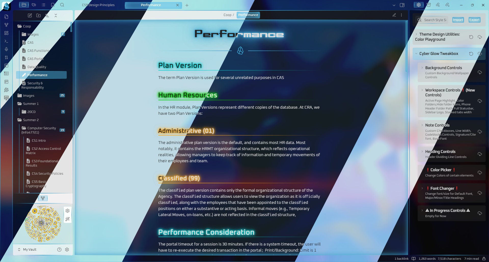

# Obsidian-CyberGlow

A pleasant Minimalist looking theme, with glow effects. Many minimalist or clean themes are very monotone and dull/depressing to look at in order to keep you focused. However my theme strikes a great balance of colorful, glowy with little to no distractions in the UI and useable with a cursor.

A mix of TriDiamond's Obsidianite and Deatau's 80s Glow themes for Obsidian.md but has gradually transformed into its own unique, minimalist and clean theme.

This theme currently supports Deathau's highlights and Notation Color Blocks.

## Warning
This theme does not work correctly as of yet with Mobile Obsidian.

## Font & Preview
Optional Fonts: [Fonts Install Optional.zip](https://github.com/ArtexJay/Obsidian-CyberGlow/files/6705588/Fonts.Install.Optional.zip)

